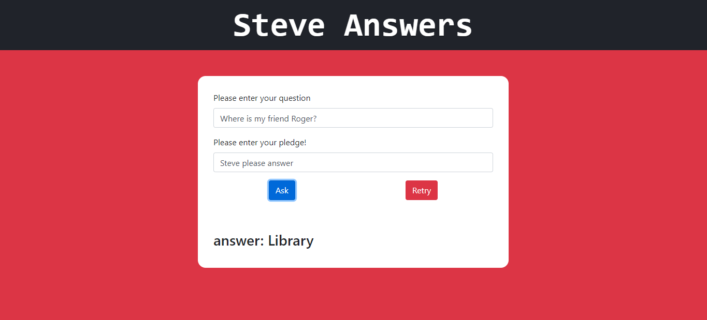

# Steve-answers
Link: [Steve Answers](https://arya002.github.io/Steve-answers/)

a spin-off of peteranswers.com
This is a spin-off for the popular [Peter Answers](https://peteranswers.com/) we
Prank your friends by claiming this is an AI site that knows everything about them.
Ask them a question and type it in the question box.
Then write the petition in the box below.

> ## The catch 
> While you write the petition ("Steve please answer") press the "." key the type the actual answer. - The petition will keep on being typed as normal
> from the background script, so no one can tell when you're typing the answer. After typing the answer, press the "." key again the finish the rest of the petition. Then click on
> "Ask". The answer would magically appear. If your friends try it themselves without knowing the "." trick, the srcipt would give them a generic response.
> 
> ##### Have fun!!

## Tech Stack

I used React js to build this website with help from Bootstrap for the UI.
A simple script runs in the background to store the actual answer and keep the "false" typing going.
